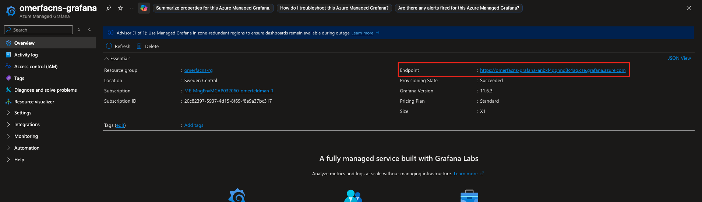
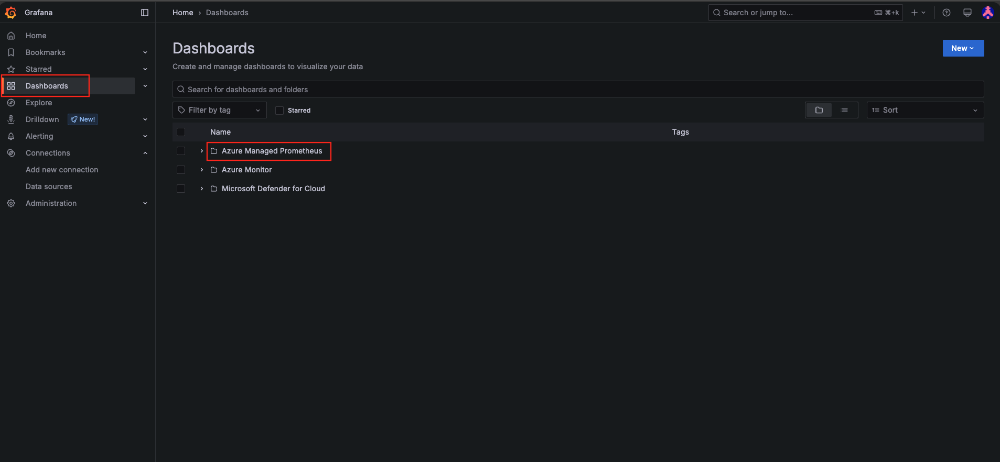
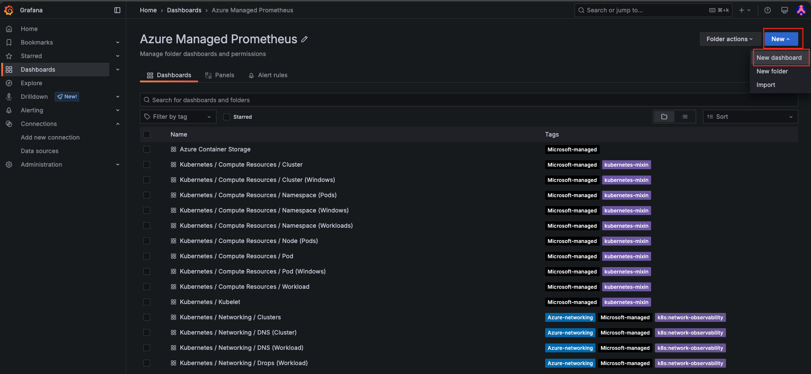
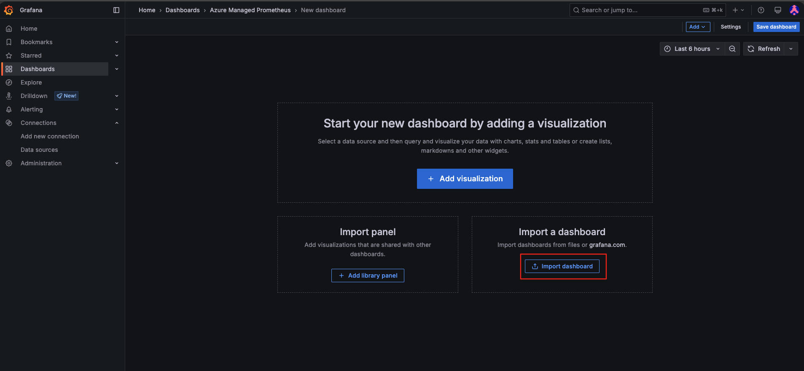
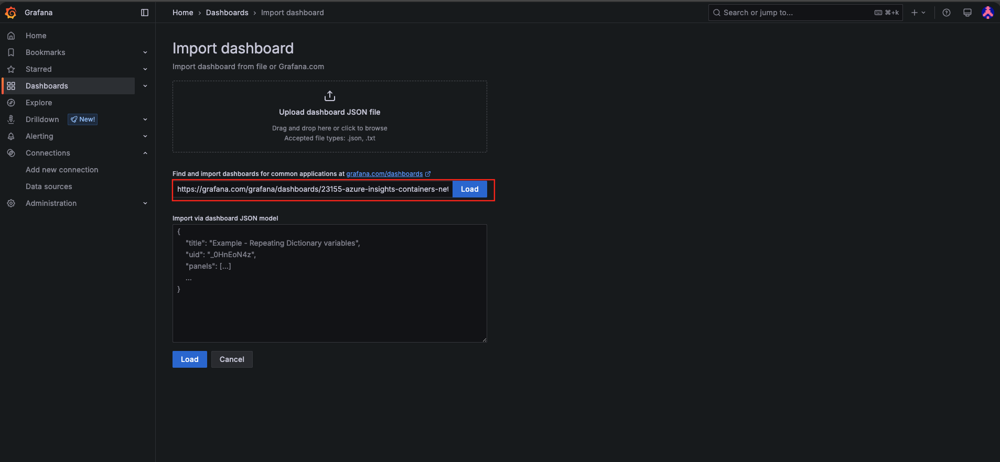
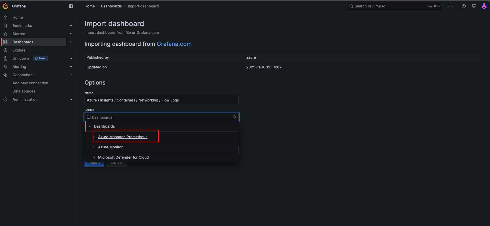
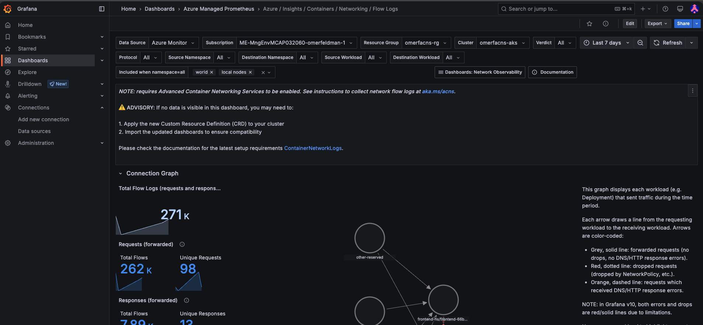

# Advanced Container Networking Services Workshop

This directory contains all the assets needed for the AKS Advanced Container Networking Services (ACNS) workshop including Terraform configurations for deploying the complete Azure infrastructure, Presentation, Cheatsheet and more.

## Prerequisites

### Required Tools

1. **Terraform** (>= 1.5)
   - [Download and install Terraform](https://www.terraform.io/downloads)
   - Verify installation: `terraform version`

2. **Azure CLI**
   - [Install Azure CLI](https://docs.microsoft.com/en-us/cli/azure/install-azure-cli)
   - Verify installation: `az --version`

3. **kubectl**
   - [Install kubectl](https://kubernetes.io/docs/tasks/tools/)
   - Verify installation: `kubectl version --client`

4. **Docker Desktop**
   - [Install Docker Desktop](https://www.docker.com/products/docker-desktop/)
   - Verify installation: `docker version`

### Azure Requirements

- **Active Azure Subscription**
- **Sufficient Azure permissions** to create:
  - Resource Groups
  - Azure Kubernetes Service (AKS) clusters
  - Azure Container Registry (ACR)
  - Virtual Networks and Subnets
  - Log Analytics Workspaces
  - Azure Monitor resources
  - Azure Managed Grafana instances

### Authentication

Before deploying, authenticate with Azure:

```bash
az login
```

To verify you're using the correct subscription:

```bash
az account show
az account list --output table
```

To set a specific subscription:

```bash
az account set --subscription "<subscription-id>"
```

## Configuration

### Install AZ Preview extensions

```bash
az extension add --name aks-preview
az extension update --name aks-preview
```


### Enable Azure Account Preview Features

This deployment requires registering Azure preview features. **Important:** Feature registration can take 10-15 minutes to complete.

#### Register Advanced Networking Flow Logs Preview

Enabling [Advanced Networking Flow Logs](https://learn.microsoft.com/en-us/azure/aks/advanced-container-networking-services-overview?tabs=cilium#register-the-advancednetworkingflowlogspreview-feature-flag) feature

Enabling [Advanced Networking L7Policy](https://learn.microsoft.com/en-us/azure/aks/advanced-container-networking-services-overview?tabs=cilium#register-the-advancednetworkingl7policypreview-feature-flag) feature

Enabling [Advanced Networking WireGuard](https://learn.microsoft.com/en-us/azure/aks/advanced-container-networking-services-overview?tabs=cilium#register-the-advancednetworkingwireguardpreview-feature-flag) feature

Enabling [Advanced Networking Performance](https://learn.microsoft.com/en-us/azure/aks/how-to-enable-ebpf-host-routing) feature 

```bash
az feature register --namespace "Microsoft.ContainerService" --name "AdvancedNetworkingFlowLogsPreview"
az feature register --namespace "Microsoft.ContainerService" --name "AdvancedNetworkingL7PolicyPreview"
az feature register --namespace "Microsoft.ContainerService" --name "AdvancedNetworkingWireGuardPreview"
az feature register --namespace "Microsoft.ContainerService" --name "AdvancedNetworkingPerformancePreview"
```

Check the registration status (wait until all state shows "Registered"):

```bash
az feature show --namespace "Microsoft.ContainerService" --name "AdvancedNetworkingFlowLogsPreview"
az feature show --namespace "Microsoft.ContainerService" --name "AdvancedNetworkingL7PolicyPreview"
az feature show --namespace "Microsoft.ContainerService" --name "AdvancedNetworkingWireGuardPreview"
az feature show --namespace "Microsoft.ContainerService" --name "AdvancedNetworkingPerformancePreview"
```

#### Refresh the Resource Provider

After all features are registered, refresh the Microsoft.ContainerService provider:

```bash
az provider register --namespace Microsoft.ContainerService
```

### Required Variables

Create a `terraform.tfvars` file in the `IaC` directory with the following required variables:

```hcl
subscription_id = "your-subscription-id"
base_name       = "your-unique-prefix"  # Used as prefix for all resources (only letters)
```

### Optional Variables

You can override these optional variables (defaults shown):

```hcl
region                           = "swedencentral"
virtual_network_address_prefix   = "10.0.0.0/16"
aks_subnet_address_prefix        = "10.0.0.0/18"
aks_service_cidr                 = "192.168.0.0/20"
aks_dns_service_ip               = "192.168.0.10"
pod_cidr                         = "10.244.0.0/16"
grafana_major_version            = "11"
```

### Example terraform.tfvars

```hcl
subscription_id = "12345678-1234-1234-1234-123456789abc"
base_name       = "acnsworkshop"
```

## Deployment Steps

1. **Navigate to the infrastructure directory:**
   ```bash
   cd IaC/infra
   ```

2. **Initialize Terraform:**
   ```bash
   terraform init
   ```

3. **Apply the configuration:**
   ```bash
   terraform apply -var-file="../terraform.tfvars" -auto-approve
   ```
   In case an error with the following text appears, wait a few minutes and rerun the terraform apply command: "User-installed iptables rules found. Number of affected nodes is X. Please remove the iptables rules before enabling advanced networking performance (advancedNetworking.performance.accelerationMode = BpfVeth). If there are no user-installed iptables rules, please try again after some time."

4. **Configure kubectl access to the AKS cluster:**
   ```bash
   az aks get-credentials --resource-group <resource-group-name> --name <cluster-name>
   ```
   
   The resource group and cluster names will be output after the apply completes.

5. **Navigate to the application directory:**
   ```bash
   cd ../app
   ```

6. **Initialize Terraform:**
   ```bash
   terraform init
   ```

7. **Apply the configuration:**
   ```bash
   terraform apply -var-file="../terraform.tfvars" -auto-approve
   ```

## What Gets Deployed

This Terraform configuration creates:

- **Azure Container Registry (ACR)** - For storing container images
- **Azure Kubernetes Service (AKS)** - Managed Kubernetes cluster
- **Virtual Network** - Network infrastructure with dedicated subnets
- **Log Analytics Workspace** - For centralized logging
- **Azure Monitor** - Monitoring and diagnostics
- **Azure Managed Grafana** - Visualization and dashboards
- **Applications in AKS** - Both Frontend and Backend applications used in the workshop
- **Advanced configuration enforcement** - Used to ease the use in this workshop

## Clean Up

To destroy all created resources:

```bash
cd IaC/app
terraform destroy -var-file="../terraform.tfvars" -auto-approve
cd ../infra
terraform destroy -var-file="../terraform.tfvars" -auto-approve
```

⚠️ **Warning:** This will permanently delete all resources created by this configuration.

## Troubleshooting

### Common Issues

1. **Authentication errors:**
   - Ensure you're logged in: `az login`
   - Verify correct subscription: `az account show`

2. **Insufficient permissions:**
   - Verify you have Contributor or Owner role on the subscription

3. **Resource name conflicts:**
   - Use a unique `base_name` to avoid naming conflicts

4. **Quota limits:**
   - Check your subscription has sufficient quota for VM cores and other resources

## Terraform Providers

This configuration uses:
- `azurerm` provider (v4.53.0) - Azure Resource Manager
- `azapi` provider (v2.7.0) - Azure API provider
- `null` provider (v3.2.4) - Utility provider

## Next Steps

After infrastructure  & Application deployment:

1. Follow the workshop instructions for Advanced Container Networking Services in the presentation
2. Explore the monitoring dashboards in Grafana

## Additional Resources
Grafana Dashboard Import steps

1. Enter to the Azure Portal and find the managed grafana resource, then enter to its URL


2. Click on the Dashboards blade and enter the Azure Managed Prometheus folder


3. Here you can see all the dashboards within the directory, to import a new one, click on New and then New Dashboard 


4. Click on Import Dashboards, if a popup comes up, click on discard


5. Enter the dashboard URL that you got from the presentation and hit Load


6. Choose the Azure Managed Prometheus Folder and click import


7. Great, now you can head back to the dashboards view and enter the Azure Managed Prometheus folder and see the imported dashboard

